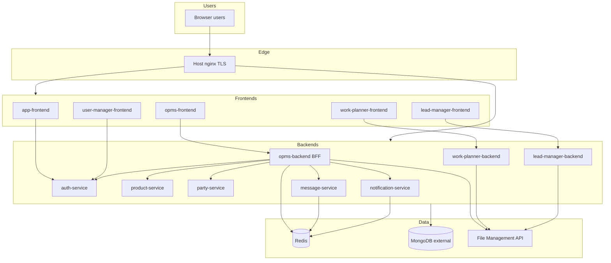

# System Architecture

## Context

OPMS is a **Docker Compose–orchestrated microservice + micro-frontend** system. Browsers talk to Next.js apps and/or public API hostnames (via host nginx in production). Backends share a **MongoDB** database (external) and **Redis** (in Compose) for queues.

## Runtime ports (Compose defaults)

| Service | Port |
|---------|------|
| opms-backend | 7001 |
| opms-frontend | 7002 |
| auth-service | 7003 |
| user-manager-frontend | 7004 |
| product-service | 7005 |
| party-service | 7006 |
| work-planner-backend | 7007 |
| work-planner-frontend | 7008 |
| lead-manager-backend | 7009 |
| lead-manager-frontend | 7010 |
| message-service | 7011 |
| notification-service | 7012 |
| app-frontend | 7013 |
| redis | 7014→6379 |

Sources: `docker-compose.yml`, `DOCKER.md`

## Architectural style

| Style element | Application |
|---------------|-------------|
| Microservices | Domain-split Node/Express services |
| BFF / API gateway-lite | opms-backend proxies auth/product/party/message/notification |
| Micro-frontends | Separate Next.js apps; SSO hub launches peers |
| Shared database | Multiple services point at same Mongo URI (**Inferred** from env sharing; collection ownership logical) |
| Async messaging | BullMQ on Redis (not RabbitMQ) |

## Related

- [Component Architecture](02-component-architecture.md)
- [Deployment Architecture](10-deployment-architecture.md)
