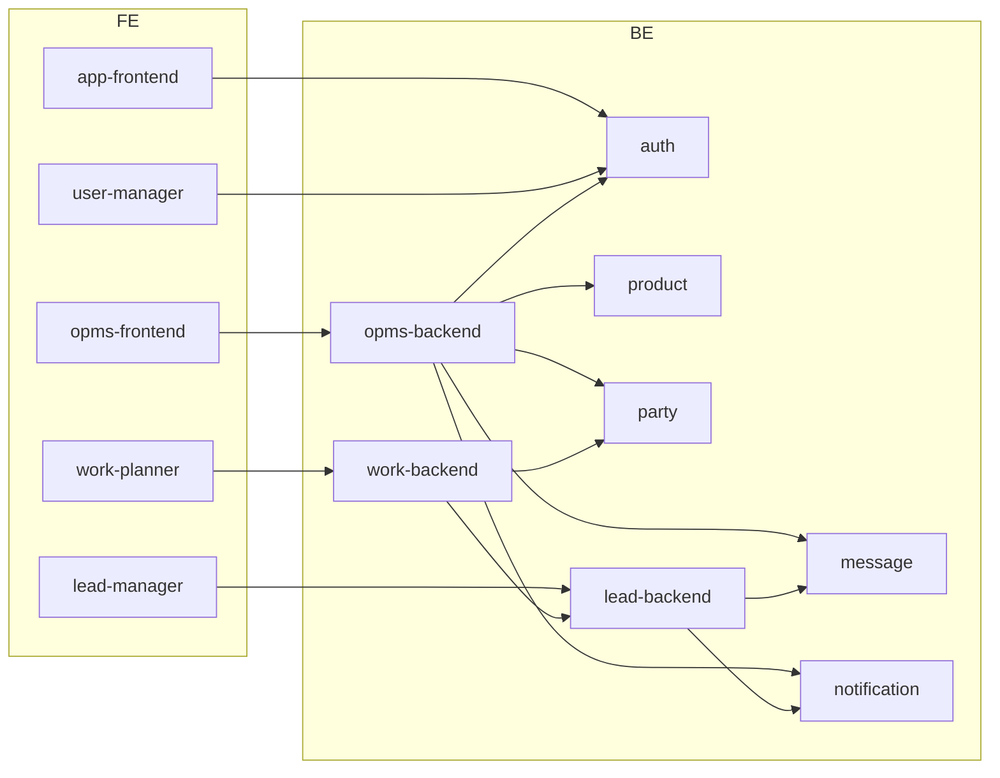

# Component Architecture

## Backend components

| Component | Responsibility |
|-----------|----------------|
| **auth-service** | Login, JWT, users, roles, departments, portals, company info; seeds defaults |
| **opms-backend** | Order domain, workflow, finance/dispatch/fleet/transport planner, dashboards; proxies sibling APIs; BullMQ workers |
| **product-service** | Product catalog, groups/subgroups/brands/manufacturers, kits, batches |
| **party-service** | Parties, zones, party-product mappings/rates |
| **lead-manager-backend** | Leads, quotations, lead masters, follow-up cron; proxies messaging |
| **work-planner-backend** | Work plans, visits, works, expenses, settings; proxies parties/leads/messaging |
| **message-service** | Email/WhatsApp/messages queues |
| **notification-service** | In-app notifications, SSE, web push |

## Frontend components

| Component | Responsibility |
|-----------|----------------|
| **app-frontend** | Login + portal launcher SSO hub |
| **opms-frontend** | Multi-role OPMS workspace |
| **user-manager-frontend** | Identity administration UI |
| **lead-manager-frontend** | CRM UI |
| **work-planner-frontend** | Field planning UI |

## Shared technical components

- Mongoose models / `mongoRegistry.js` (duplicated across services)
- `softDelete.plugin.js`
- JWT auth middlewares
- Multer uploads → File Management API
- Swagger (opms-backend only)

## Component diagram

