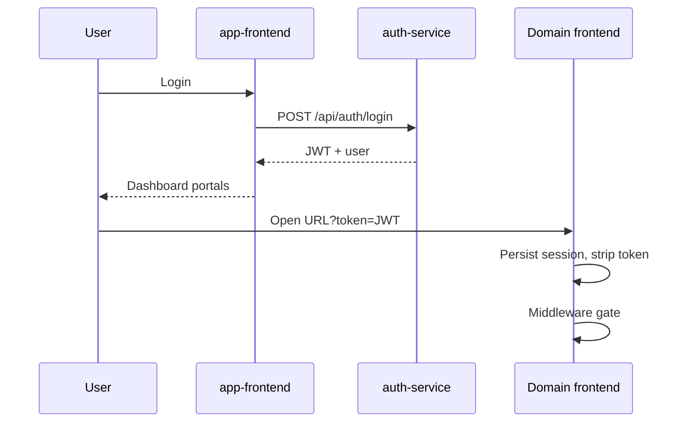

# Frontend Architecture

## Stack (all five apps)

- **Next.js 16** App Router
- **React 19**
- **Redux Toolkit** + RTK Query
- **Tailwind CSS 4**
- **lucide-react**, **sonner**

## Hub-and-spoke

## Session storage patterns

| App | localStorage key (primary) | Cookies |
|-----|----------------------------|---------|
| app-frontend | `shakti.app.session` | `shakti_session`, `medica_session` |
| opms-frontend | `medica.auth` | `medica_session`, `medica_opms_roles` |
| user-manager | `shakti.user_manager.session` | shared session cookies |
| lead-manager | `shakti.lead_manager.session` | shared |
| work-planner | `shakti.work_planner.session` | shared |

## OPMS shell

- Dynamic route `/[portal]/[[...rest]]`
- Shared Sidebar/Topbar
- Portal allowlists for paths
- Deep links to Lead Manager / User Manager iframe for some paths

## API clients

| Frontend | Primary base |
|----------|--------------|
| app-frontend | `NEXT_PUBLIC_AUTH_SERVICE_URL` |
| opms-frontend | `NEXT_PUBLIC_API_ORIGIN` → opms-backend |
| user-manager | auth-service URL |
| lead-manager | `NEXT_PUBLIC_LEAD_MANAGER_SERVICE_URL` |
| work-planner | `NEXT_PUBLIC_WORK_PLANNER_SERVICE_URL` |

**Note:** `NEXT_PUBLIC_*` values are **build-time** baked into images.
