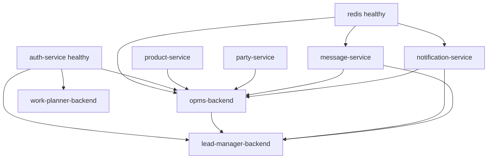

# Service Architecture

## Service communication matrix

| From | To | Mechanism |
|------|----|-----------|
| Frontends | Owning backends | HTTPS/HTTP REST + Bearer JWT |
| opms-backend | auth/product/party/message/notification | HTTP proxy / axios |
| work-planner-backend | party, lead-manager, message, notification | HTTP proxy |
| lead-manager-backend | message, notification | HTTP proxy |
| auth-service | notification-service | proxy `/api/notifications` |
| Queue producers | Redis | BullMQ |
| All APIs | MongoDB | Mongoose |
| Upload flows | File Management API | HTTP + API key |

## Startup dependencies (compose)

## Health

Each backend exposes `GET /health`. Frontends: **no** compose healthchecks in base file.
