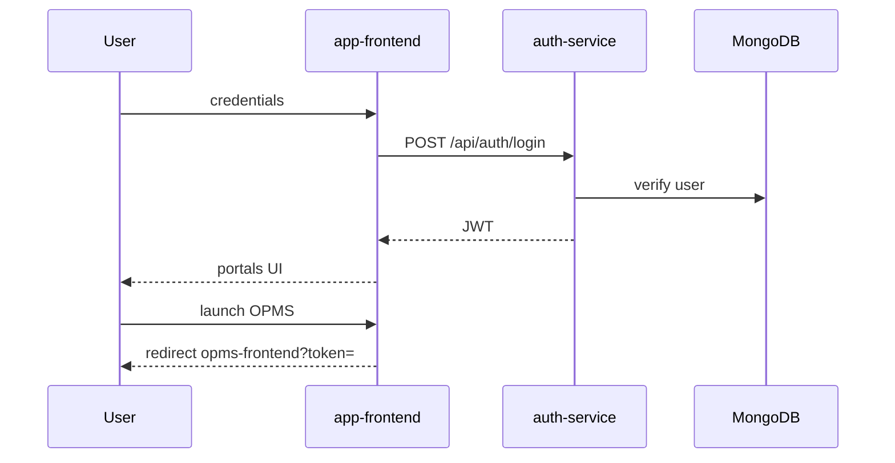
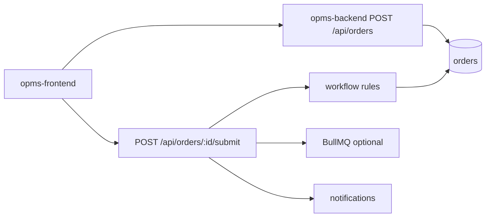

# Data Flow

## 1. Login and portal launch

## 2. Create and submit order

## 3. Approval path (simplified)

Sales/Admin create/update OrderApproval → send-to-finance → finance approve/amend → send-to-account → account approve → order status advances per transitions → dispatch created → transport/delivery.

## 4. Messaging

Domain event/API → message-service enqueue → worker sends via Graph/SMTP/WhatsApp → Message document status updated.

## 5. File upload

Client → attachments route (multer) → File Management API → Attachment metadata in Mongo → view/download via `/api/files/:fileId/*` redirect.
