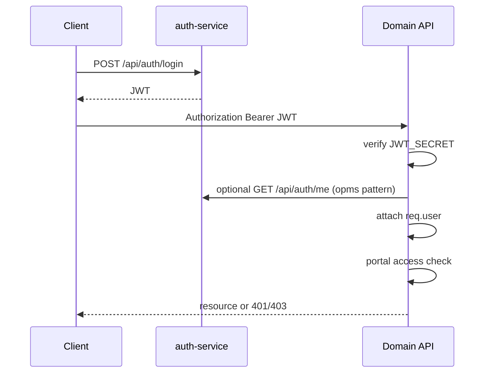

# Authentication & Authorization

## Authentication flow

## Token

- Signed with `JWT_SECRET`
- Expiry `JWT_EXPIRES_IN` (example default `7d`)
- Optional `MASTER_PASSWORD` break-glass (**dangerous if set in prod**)

## Authorization layers

1. **Authenticated** — valid JWT
2. **Portal membership** — `portals[]` contains required `portal_code`
3. **access_roles** — role string must match portal gate (or admin bypass where coded)
4. **Handler-level checks** — department / role for specific actions (workflow rules, lead admin routes)
5. **Soft-delete permission** — authenticated (+ opms) for trash/restore on some routes; swagger mentions permission codes that may be aspirational vs portal model — **Requires confirmation** for fine-grained permission codes vs portal roles

## OPMS roles

`super_admin | admin | sales | finance | account | dispatch`

## Cross-portal

Lead list may allow work_planner access in some routes (`requireLeadManagerOrWorkPlannerAccess`).

## Public / weakly protected surfaces (document carefully)

| Surface | Notes |
|---------|-------|
| `POST /api/auth/login` | Public |
| `GET /api/company-info` | Public on auth-service |
| Google Sheet webhooks | Secret header/param |
| WhatsApp webhooks | Public verify/receive |
| notification internal POSTs | No requireAuth — service trust |
| opms terms-and-conditions router | No requireAuth on router |
| lead attachments router | No requireAuth on router |
| work-planner attachment view | Public view path before auth |

See [Security](../06-developer-deployment/19-security.md).
