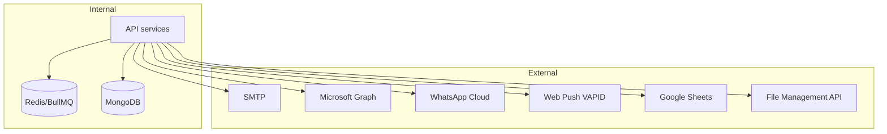

# Integration Architecture

## Email

Preferred: Microsoft Graph sendMail when configured; SMTP fallback via nodemailer.

## WhatsApp

Cloud API templates + webhook endpoints on message-service.

## Files

All binary storage delegated to external File Management API (historically MinIO-backed). Local `minio-data/` is leftover, not compose-managed.

## Sheets

Inbound webhooks protected by `GOOGLE_SHEET_WEBHOOK_SECRET`.
