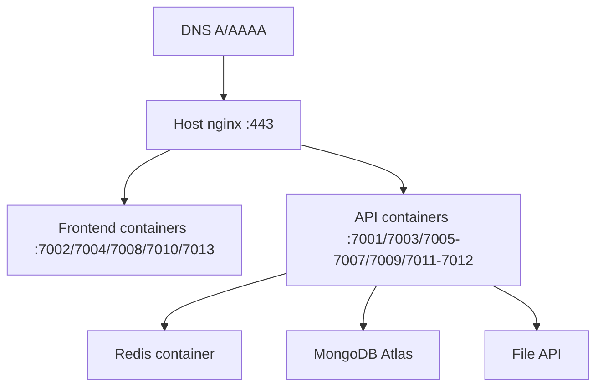

# Deployment Architecture

## Recommended path (from DOCKER.md)

1. Configure `.env.docker`
2. `docker compose --env-file .env.docker up --build -d`
3. Install nginx site + certbot SANs
4. Point DNS to host

## Prod compose file caveat

`docker-compose.prod.yml` is a **partial** stack — prefer full `docker-compose.yml` unless ops intentionally runs a subset (**Verified** by file contents).

## Rollback

**Not identified** as automated. Typical approach: redeploy previous image tags / git revision and `compose up` — **Requires confirmation** of image registry strategy (compose builds locally by default).
