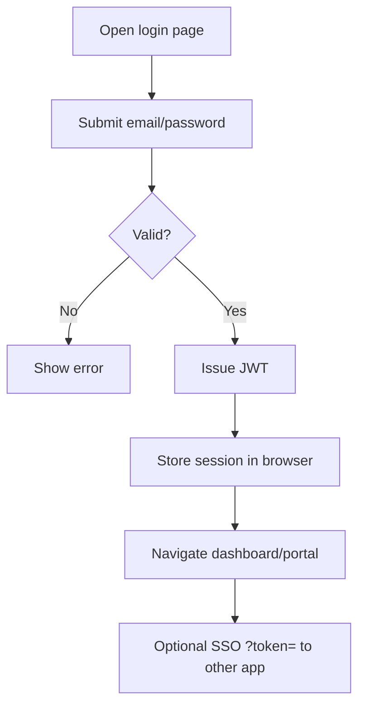

# Module: Authentication

## Purpose
Authenticate users, issue JWTs, expose current user profile, and support password change.

## Actors
Any user with an active auth-service account; App Frontend and all portal frontends.

## Preconditions
- auth-service running and Mongo reachable
- User exists with password hash; `is_active` true (**Inferred** inactive users rejected — verify service)

## Workflow

## Business Rules
- Shared `JWT_SECRET` across services
- Optional `MASTER_PASSWORD` can authenticate as any user if set — **must be empty in production**

## Validations
Email/password required on login (controller-level).

## Permissions
Login public; `/me` and change-password require auth.

## Exceptions / Errors
401 invalid credentials; 401/403 on protected routes without/with wrong token.

## Related APIs
- `POST /api/auth/login`
- `GET /api/auth/me`
- `POST /api/auth/change-password`

## Related DB
User, Role, Portal, Department, CompanyInfo (auth-service)

## Related UI
app-frontend `/`, portal `/login` pages

## Dependencies
auth-service; MongoDB; frontends

## Source
`auth-service/src/modules/auth/`
