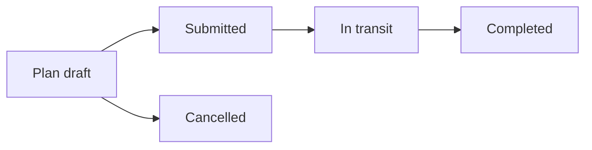

# Module: Dispatch & Transport

## Purpose
Create dispatches, manage shipments/deliveries/returns, fleet masters, and transport planner.

## Actors
dispatch, admin, account, finance, super_admin (per nav/API gates)

## Workflow — transport plan
1. List eligible orders
2. Create plan for date/agent
3. Add orders
4. Submit plan
5. Mark packed / generate LR / dispatched / delivered on plan orders
6. Complete or cancel plan

## Related APIs
`/api/dispatch`, `/api/transport`, `/api/order-deliveries`, `/api/order-returns`, `/api/vehicles`, `/api/drivers`, `/api/transport-agents`, `/api/transport-plans`

## Related DB
OrderDispatch, TransportShipment, OrderDelivery, OrderReturn, Vehicle, Driver, TransportAgent, TransportPlan, TransportPlanOrder

## Note
TransportShipment references `Transporter` model not found in registry — **Unknown** / possible schema debt.

## Related UI
Dispatch portal; transport planner pages; fleet routes

## Source
`opms-backend/src/modules/dispatch|transport|orderDelivery|orderReturn|fleet|transportPlanner/`
