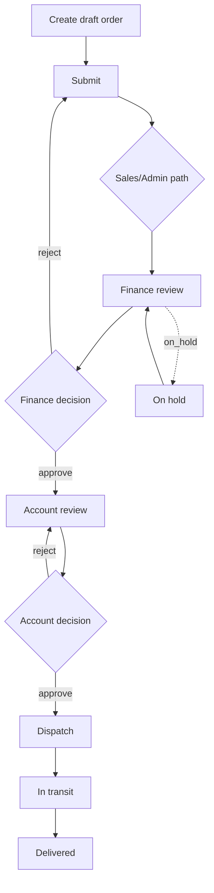

# Module: Orders & Workflow

## Purpose
Create and progress sales orders through departmental statuses to delivery/cancellation.

## Actors
OPMS roles: sales, admin, finance, account, dispatch, super_admin

## Preconditions
- OPMS portal access
- Party/product masters available for line items

## Workflow

Exact edges: see [Business Rules](../01-product/08-business-rules.md).

## Business Rules
- Transition graph enforced
- Flag types can block dispatch/transit/delivery
- Pricing lock after certain statuses
- Soft-delete supported

## Validations
Order payload validations in order service/controller (**see service for required fields**).

## Permissions
`requireAuth` + `requireOpmsAccess`; transition permission by department rules.

## State Transitions
See Order.status enums and `workflow.transitions.js`.

## Related APIs
`/api/orders/*`, `/api/orders/:id/transition`, `/submit`, `/close-after-full-delivery`

## Related DB
Order, OrderWorkflow, OrderStatusHistory, order_items embedded

## Related UI
opms-frontend `/[portal]/orders`, `create-order`, `order/[id]`

## Dependencies
party/product data; notifications/messages optional

## Source
`opms-backend/src/modules/orders/`, `workflow/`
