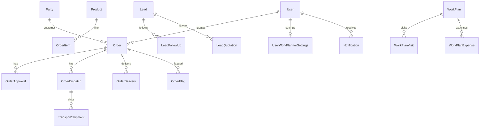

# Relationships

Logical relationships (Mongo does not enforce FKs):

## Notable refs
- Order → party, customer, lead, created_by
- OrderApproval → order
- PartyProductRate → party, product, mapping
- Attachment → entity_type + entity_id (polymorphic)
- TransportShipment → transporter ref **without registered Transporter model** (debt)

## Related
- [ERD](09-erd.md)
