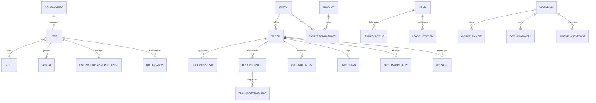

# ERD

```mermaid
erDiagram
  COMPANYINFO ||--o{ USER : company
  USER }o--o{ ROLE : has
  USER }o--o{ PORTAL : portals
  PARTY ||--o{ ORDER : orders
  PRODUCT ||--o{ PARTYPRODUCTRATE : rates
  PARTY ||--o{ PARTYPRODUCTRATE : rates
  ORDER ||--o{ ORDERAPPROVAL : approvals
  ORDER ||--o{ ORDERDISPATCH : dispatches
  ORDERDISPATCH ||--o{ TRANSPORTSHIPMENT : shipments
  ORDER ||--o{ ORDERDELIVERY : deliveries
  ORDER ||--o{ ORDERFLAG : flags
  ORDER ||--o{ ORDERWORKFLOW : workflow
  LEAD ||--o{ LEADFOLLOWUP : followups
  LEAD ||--o{ LEADQUOTATION : quotations
  WORKPLAN ||--o{ WORKPLANVISIT : visits
  WORKPLAN ||--o{ WORKPLANWORK : works
  WORKPLAN ||--o{ WORKPLANEXPENSE : expenses
  USER ||--o| USERWORKPLANNERSETTINGS : settings
  USER ||--o{ NOTIFICATION : notifications
  ORDER ||--o{ MESSAGE : messages
```

Screenshot: Not available in repository.
