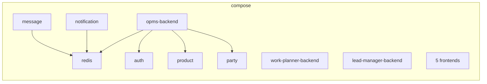

# Docker

## Compose services (base)
redis + 8 APIs + 5 frontends. See [Infrastructure Architecture](../02-architecture/09-infrastructure-architecture.md).

## Images
Build contexts per service folder; `node:20-alpine`.

## Volumes
`redis_data` only.

## Healthchecks
Backends + redis; frontends none in base compose.

## Dev overlay
`Dockerfile.dev`, bind-mount `src`, watch modes, FE healthchecks disabled.

## Related
Root [DOCKER.md](../../DOCKER.md)
