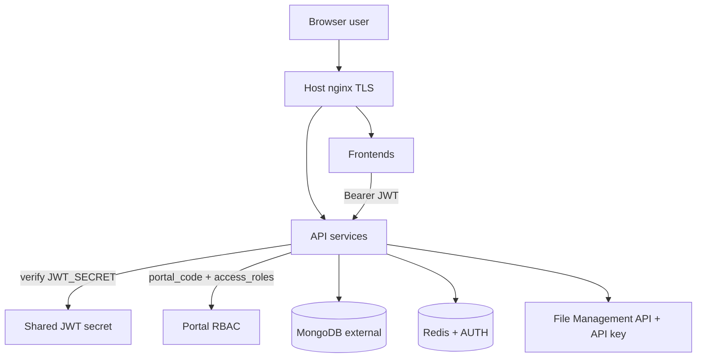
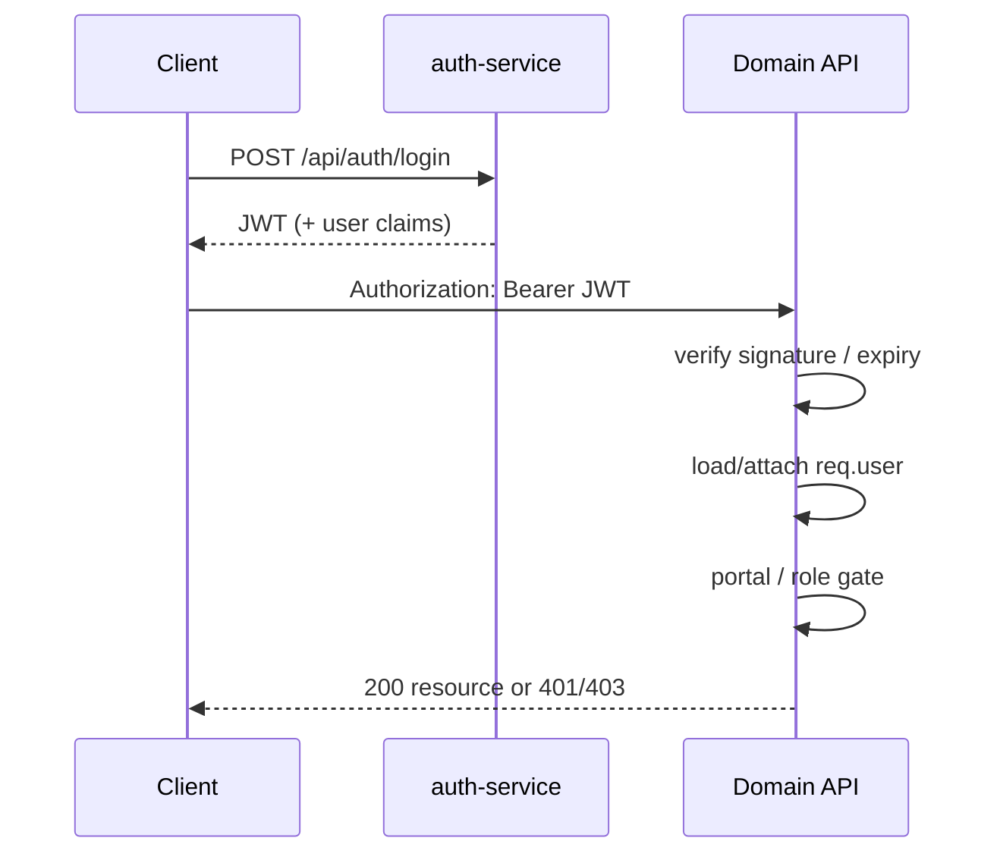
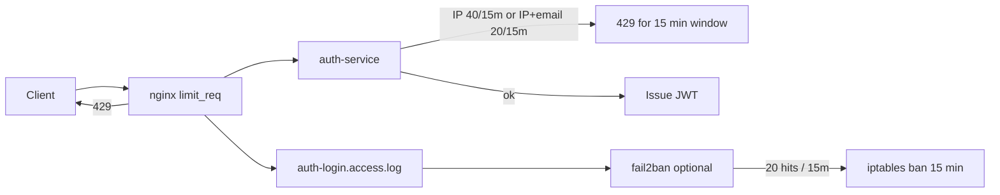
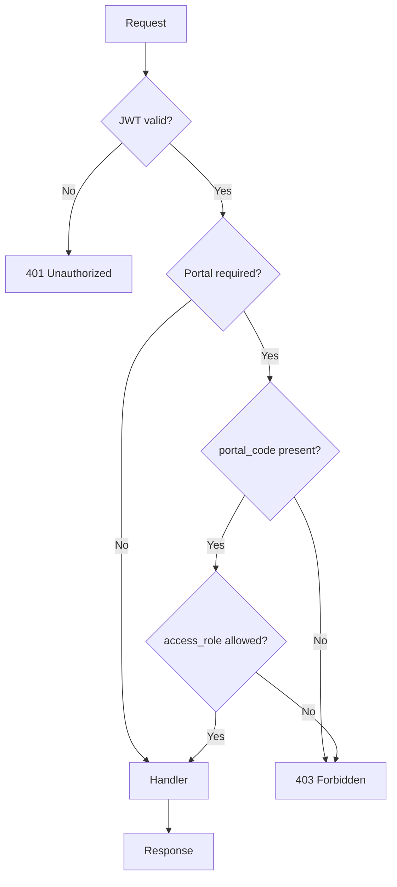
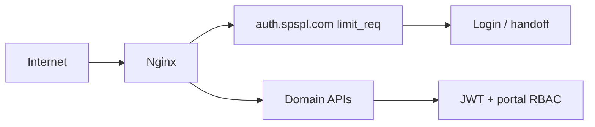
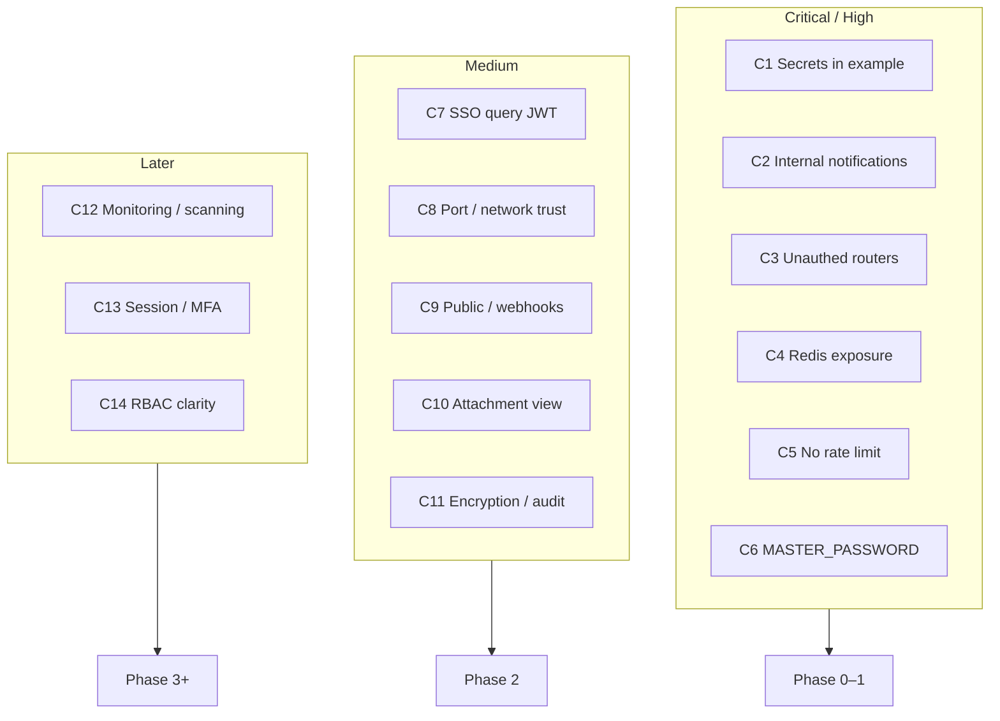
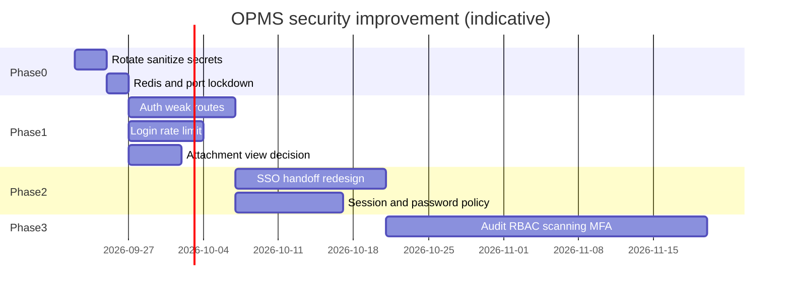

# OPMS Security Documentation

**Status:** Verified from repository implementation (Phases 0–3 hardening applied) unless marked otherwise.  
**Scope:** Authentication, authorization, secrets, transport security, known risks, consolidated challenges (§11), phased improvement plan (§12), plus threat model / data-protection / authorization companion docs — not a penetration-test report.

**Sources:**
- `auth-service/`, `opms-backend/src/middlewares/`, portal middlewares (lead-manager, work-planner)
- `nginx/` TLS + `logging.conf` / `auth-rate-limit.conf` / fail2ban jails
- `docker-compose.yml`, `.env.docker.example`, `DOCKER.md`
- `.github/workflows/security-scans.yml`
- `docs/02-architecture/07-authentication-authorization.md`
- `docs/06-developer-deployment/19-security.md`
- Companion: [02-threat-model](./02-threat-model.md), [03-data-protection-and-ops](./03-data-protection-and-ops.md), [04-authorization-model](./04-authorization-model.md)

---

## 1. Security model overview



### Trust boundaries

| Boundary | What crosses it | Control |
|----------|-----------------|---------|
| Internet → host | HTTPS | nginx TLS + HSTS snippets |
| Browser → API | REST + JWT | Bearer token; CORS origins |
| Service → service | Internal HTTP on compose network | Shared JWT; internal notification routes require service JWT |
| Service → Mongo | Connection string | `MONGO_URI` secret |
| Service → Redis | Queue/jobs | Redis AUTH (`REDIS_PASSWORD`); host bind `127.0.0.1` only |
| Service → File API | Uploads | `FILE_MANAGEMENT_API_KEY` |

---

## 2. Authentication

### Mechanism

- **JWT** signed with shared `JWT_SECRET` across services
- Passwords hashed with **bcrypt** (`bcryptjs`)
- Token TTL via `JWT_EXPIRES_IN` (default **`8h`**)
- Optional **`MASTER_PASSWORD`**: break-glass login as any user if set — **must be empty in production**
- Password policy: min **10** chars, letter + number, no spaces (create user / change password)
- Portal SSO: one-time **`?handoff=`** codes (legacy `?token=` still accepted)

### Login flow



### Obtain token

```http
POST /api/auth/login
Content-Type: application/json

{ "email": "user@example.com", "password": "********" }
```

Available on auth-service (`:7003`) or via opms-backend proxy (`:7001/api/auth/login`).

### Session introspection

```http
GET /api/auth/me
Authorization: Bearer <token>
```

### Frontend session handling

| App | Primary storage | Notes |
|-----|-----------------|-------|
| app-frontend | `shakti.app.session` + cookies | SSO hub; launches peers with one-time `?handoff=` |
| opms-frontend | `medica.auth` + cookies | Exchanges handoff (middleware + bootstrap); legacy `?token=` still accepted |
| user / lead / work planner | per-app `shakti.*.session` | Middleware exchanges `?handoff=` → session cookies |

### SSO handoff (preferred)

```http
POST /api/auth/handoff
Authorization: Bearer <access-token>

→ { "code": "<one-time>", "expires_in": 60 }

POST /api/auth/handoff/exchange
Content-Type: application/json

{ "code": "<one-time>" }

→ { "token": "<jwt>", "user": { ... } }
```

**Risk note:** Prefer `?handoff=` over putting JWTs in URLs. Legacy `?token=` remains during rollout. SSE/file browser navigations may still append `?token=` (separate from portal SSO).

Default access-token TTL is **`JWT_EXPIRES_IN=8h`**. Refresh tokens are not implemented — users re-login after expiry.

Password policy (create user / change password): **min 10 characters**, at least one letter and one number, no spaces.

### Login rate limiting & 15-minute IP block

Brute-force controls are layered (app → nginx → optional fail2ban).

| Layer | Where | Rule | Effect |
|-------|-------|------|--------|
| App — IP | `auth-service` `loginIpBlocker` | **40** failed logins / **15 min** per IP (`skipSuccessfulRequests`) | HTTP **429** — try again in 15 minutes |
| App — IP+email | `loginEmailRateLimiter` | **20** failed / **15 min** per IP+email | HTTP **429** |
| App — handoff | `handoffExchangeRateLimiter` | **40** / **15 min** | Protects SSO code exchange |
| Edge — nginx | `snippets/auth-rate-limit.conf` | `limit_req` on `POST /api/auth/login` (and handoff exchange) | HTTP **429** at edge; writes `auth-login.access.log` |
| Host — fail2ban | `nginx/fail2ban/jail.d/opms-auth.conf` | **20** matches in **15 min** → **bantime 15m** | Hard IP ban at firewall for **15 minutes** |



**Deploy fail2ban (ops):** copy `nginx/fail2ban/filter.d/*` and `jail.d/*` to `/etc/fail2ban/`, ensure `logging.conf` is included from nginx `http {}`, then `fail2ban-client reload`.

## 3. Authorization (RBAC)

### Layers

1. **Authenticated** — valid JWT  
2. **Portal membership** — `user.portals[]` contains required `portal_code`  
3. **access_roles** — role string must match portal gate (admin bypass where coded)  
4. **Handler-level checks** — department/workflow rules for specific actions  
5. **Soft-delete routes** — authenticated (+ OPMS portal) on many trash/restore endpoints  

### Portal codes and roles (observed)

| portal_code | Seeded by default? | access_roles (observed) |
|-------------|--------------------|-------------------------|
| `opms` | Yes (`DEFAULT_PORTALS`) | `super_admin`, `admin`, `sales`, `finance`, `account`, `dispatch` |
| `work_planner` | **No** | `admin`, `manager`, `executive` (+ admin bypasses) |
| `lead_manager` | **No** | `admin`, `manager`, `executive` |
| `user_manager` | **No** | `admin`, `super_admin` (FE + `requireUserManagerAdmin` on `/api/users*`) |

### Middleware gates

| Gate | Applies to |
|------|------------|
| `requireAuth` | Most domain routes |
| `requireOpmsAccess` | OPMS domain APIs |
| `requireLeadManagerAccess` | Lead Manager (most routes) |
| `requireWorkPlannerAccess` | Work Planner routes |
| `requireUserManagerAdmin` | auth-service `/api/users*` and roles |
| `requireInternalService` | notification `/api/notifications/internal/*` |
| Webhook secret | Google Sheet ingest |

Missing `opms` portal ⇒ **403** even if `department` is set (documented in Swagger + middleware behavior).



---

## 4. Transport & edge security

### nginx (production pattern)

- TLS 1.2/1.3 via `nginx/snippets/ssl-params.conf`
- HSTS and security headers in ssl snippets
- Let's Encrypt cert paths for `*.spspl.com` / `*.medicaent.in`
- HTTP → HTTPS redirect after cert bootstrap
- SSE-specific proxy settings for notification streams
- Access log format + `limit_req` zones: `nginx/snippets/logging.conf` (include from `http {}`)
- Auth login/handoff rate limits: `nginx/snippets/auth-rate-limit.conf` on `auth.spspl.com`
- Optional fail2ban jails under `nginx/fail2ban/` (15-min IP ban)

### CORS

Configured via `CORS_ORIGINS` (comma-separated). Unknown origins are denied without Express 500.  
If empty, origins are derived from `NEXT_PUBLIC_*` / public URL env vars. Local Compose `localhost:*` ports are allowed when the allowlist is empty or includes localhost (disable with `CORS_ALLOW_LOCALHOST=0`).

### Docker network

Services communicate on the Compose bridge using internal URLs (`http://auth-service:7003`, etc.). `message-service` and `notification-service` are **not** published on the host. Internal notification routes require **service JWT**.

---

## 5. Secrets & configuration hygiene

| Variable | Secret? | Guidance |
|----------|---------|----------|
| `JWT_SECRET` | **Yes** | Long random; identical across all services |
| `MASTER_PASSWORD` | **Yes** | Leave **empty** in production |
| `MONGO_URI` / `MONGODB_URI` | **Yes** | Atlas/user credentials |
| `FILE_MANAGEMENT_API_KEY` | **Yes** | Uploads |
| `SMTP_*` / Graph / WhatsApp / VAPID private | **Yes** | Integrations |
| `GOOGLE_SHEET_WEBHOOK_SECRET` | **Yes** | Webhook auth |
| `REDIS_PASSWORD` | **Yes** | Redis AUTH (compose `--requirepass`) |
| `SEED_PASSWORD` | **Yes** | Demo only |
| `NEXT_PUBLIC_*` | No (public) | Baked into FE builds — never put secrets here |

### Critical finding (remediated in example file)

`.env.docker.example` previously contained real-looking credentials. **It now uses placeholders only.**  

**Ops still required:**
1. Rotate any secrets that may have been exposed while the old example was in git history  
2. Ensure `.env.docker` remains gitignored and never committed  
3. Set `REDIS_PASSWORD` and `REDIS_URL=redis://:<password>@redis:6379` in `.env.docker` before `compose up`  
4. Keep `MASTER_PASSWORD` empty in production  

Do not re-declare `MONGO_URI` / `JWT_SECRET` under Compose `environment:` with empty interpolation — empty values override `env_file` (see `DOCKER.md`).

---

## 6. Public and weakly protected surfaces

Documented carefully for threat modeling. Status reflects post Phase 0–1 hardening where noted.

| Surface | Auth | Risk / status |
|---------|------|---------------|
| `POST /api/auth/login` | Public + **rate limit** (40 / 15 min per IP; 20 / 15 min per IP+email) + nginx `limit_req` + optional fail2ban | Brute force mitigated at app + edge |
| `GET /api/company-info` | Public = branding only; full doc when authenticated | Hardened (no bank/tax on anonymous GET) |
| Google Sheet webhooks | Shared secret | Secret leakage ⇒ data injection |
| WhatsApp webhooks | Provider verify | Must validate hub challenge/signature per Meta rules |
| `POST /api/notifications/internal/*` | **Service JWT** (`requireInternalService`) | Hardened |
| opms `/api/terms-and-conditions` | **`requireAuth` + `requireOpmsAccess`** | Hardened |
| lead-manager `/api/attachments` | **`requireAuth` + `requireLeadManagerAccess`** | Hardened |
| work-planner attachment view | **`requireAuth` + portal gate**; FE may pass `?token=` for new-tab | Hardened |
| auth `/api/users*` | **`requireAuth` + `requireUserManagerAdmin`** | Hardened |



**Ops:** rotate any historically exposed secrets; set `REDIS_PASSWORD` in live `.env.docker`; deploy nginx snippets + optional fail2ban; keep `MASTER_PASSWORD` empty.

---

## 7. Data protection controls present

| Control | Status |
|---------|--------|
| Password hashing (bcrypt) | Implemented |
| Password strength policy | Min 10 + letter + number |
| Soft-delete (recoverable) | Many domain models |
| Append-only workflow history | OrderWorkflow / status history |
| HTTPS at edge | nginx configs |
| File binaries outside app DB | External File Management API |
| ActivityLog (OPMS / LM / WP) | Actor + timestamp + IP/UA via audit context |
| Field-level encryption at rest in app | **Not required** for v1 (Atlas at-rest + bcrypt) — see [03-data-protection-and-ops](./03-data-protection-and-ops.md) |
| Public company-info projection | Branding only when unauthenticated |

---

## 8. Infrastructure security notes

| Item | Finding |
|------|---------|
| Redis | **AUTH via `REDIS_PASSWORD`**; host port bound to `127.0.0.1` only; Compose builds `REDIS_URL` from password |
| message / notification | **Not published** to host (Compose `expose` / network only) |
| MongoDB | External; protect via Atlas IP allowlists / strong credentials |
| Containers | Production images run as **`USER node`** (non-root) |
| CI secrets scanning | **Gitleaks** workflow + auth-service `npm audit` (`.github/workflows/security-scans.yml`) |
| nginx edge | `limit_req` on login/handoff + dedicated access logs; optional fail2ban |

---

## 9. Security-related NFRs (from implementation)

| Topic | Status |
|-------|--------|
| Authentication | JWT (`8h` default) + SSO handoff codes |
| Authorization | Portal RBAC + User Manager admin gate |
| Confidentiality in transit | TLS at nginx |
| Rate limiting | Login IP + IP/email (15 min); handoff exchange limit; nginx `limit_req`; optional fail2ban |
| Secrets scanning | Gitleaks CI |
| Threat model notes | [02-threat-model.md](./02-threat-model.md) |
| Centralized WAF | **Not identified** (ops backlog) |
| Formal pen-test | Scope listed; scheduling **pending** |
| MFA | **Deferred** (IdP vs TOTP) |

---

## 10. Incident checklist (ops-oriented)

1. Rotate `JWT_SECRET` → forces re-login everywhere (coordinate downtime)  
2. Rotate Mongo, File API, Graph, WhatsApp, VAPID, webhook secrets  
3. Clear `MASTER_PASSWORD` in production env  
4. Review nginx `auth-login.access.log` / fail2ban for brute-force (429 spikes)  
5. Restart services after secret rotation: `docker compose --env-file .env.docker up -d`  
6. Rebuild frontends if any `NEXT_PUBLIC_*` changed  
7. Confirm login IP block still returns 429 for 15 minutes after abuse tests  

---

## 11. Security challenges (consolidated)

Challenges below are derived from §§2–9. Severity is relative to a typical internet-facing Compose + nginx deployment.

| ID | Challenge | Severity | Status | Evidence |
|----|-----------|----------|--------|----------|
| C1 | Example/env hygiene — real-looking secrets in `.env.docker.example` | **Critical** | Example sanitized; **rotate if exposed** | §5 |
| C2 | Unauthenticated internal notification create routes | **High** | **Mitigated** (service JWT) | §6 |
| C3 | Unauthenticated terms / lead attachments routers | **High** | **Mitigated** | §6 |
| C4 | Redis without AUTH + host port published | **High** | **Mitigated** (AUTH + localhost bind) | §8 |
| C5 | No login rate limiting / account lockout | **High** | **Mitigated** (app 15-min windows + nginx + optional fail2ban 15-min ban) | §2, §6, §9 |
| C6 | `MASTER_PASSWORD` break-glass if set in production | **High** | **Ops:** keep empty | §2, §5 |
| C7 | JWT SSO handoff via `?token=` query string | **Medium** | **Mitigated** (`?handoff=`; legacy token still accepted) | §2 |
| C8 | Published API ports / network trust | **Medium** | **Mitigated** (message/notification unpublished) | §4, §6 |
| C9 | Public `company-info` / webhook surfaces | **Medium** | company-info slimmed; webhooks still secret-dependent | §6 |
| C10 | Work-planner attachment view before auth | **Medium** | **Mitigated** (behind auth) | §6 |
| C11 | Field encryption / audit coverage | **Medium** | Audit IP/UA done; app field encryption not required v1 | §7 |
| C12 | No CI secrets scanning / threat notes | **Low–Medium** | **Mitigated** (gitleaks + threat model doc); WAF/pen-test pending | §8, §9 |
| C13 | Long JWT TTL / no MFA / no password policy | **Low–Medium** | **Partial** (8h + password policy); MFA deferred | §2 |
| C14 | Portal RBAC gaps / Permission-code ambiguity | **Low** | **Decided** (portal roles; user_manager gated) | §3 |



---

## 12. Security improvement plan

**Goal:** Close Critical/High findings first, shrink the trusted network, then raise authn/authz and ops maturity.  
**Owners (suggested):** Ops = deploy/env; Backend = API middleware/routes; Frontend = SSO/session; Product = intent decisions in §13.

### Phase 0 — Immediate (ops, days)

| Action | Addresses | Owner | Status | Acceptance criteria |
|--------|-----------|-------|--------|---------------------|
| Rotate all credentials that may have appeared in `.env.docker.example` | C1 | Ops | **Ops pending** | New secrets live; old ones revoked; services restarted |
| Sanitize `.env.docker.example` to placeholders only; confirm `.env.docker` is gitignored | C1 | Ops + Backend | **Done** (example sanitized) | Example file has no real values; `git check-ignore -v .env.docker` passes |
| Ensure production `MASTER_PASSWORD` is empty / unset | C6 | Ops | **Ops pending** | Login with master password fails in prod |
| Redis `requirepass` + bind `127.0.0.1`; wire `REDIS_URL` | C4 | Ops + Backend | **Done** in compose (set `REDIS_PASSWORD` in `.env.docker`) | Port not reachable from untrusted networks; AUTH required |
| Unpublish notification/message host ports | C2, C8 | Backend | **Done** in compose | Internal routes not reachable from internet via host ports |

### Phase 1 — Authz gaps on weak surfaces (backend, 1–2 sprints)

| Action | Addresses | Owner | Status | Acceptance criteria |
|--------|-----------|-------|--------|---------------------|
| Protect `POST /api/notifications/internal/*` with service JWT | C2 | Backend | **Done** | Unauthenticated create returns 401/403; callers send Bearer service token |
| Add `requireAuth` + portal gate to opms `/api/terms-and-conditions` | C3 | Backend | **Done** | Anonymous read/write fails |
| Add `requireAuth` / portal gate to lead-manager `/api/attachments` | C3 | Backend | **Done** | Anonymous attachment ops fail |
| Work-planner attachment view behind auth; FE appends `?token=` for new-tab opens | C10 | Backend + Frontend | **Done** | Anonymous view fails; authenticated users can open files |
| Login rate limiting (IP + email) on auth-service | C5 | Backend | **Done** | Sustained brute force yields 429 |
| Login IP block (40 / 15 min) + fail2ban jail for hard 15-min ban | C5 | Backend + Ops | **Done** (deploy fail2ban) | IP blocked for 15 min after abuse |
| Validate WhatsApp webhook signature per Meta; rotate Google Sheet webhook secret | C9 | Backend + Ops | **Partial / ops** | Invalid signature/secret rejected |

### Phase 2 — Session & transport hardening (1–2 sprints)

| Action | Addresses | Owner | Status | Acceptance criteria |
|--------|-----------|-------|--------|---------------------|
| Replace SSO `?token=` with one-time handoff code (`POST /api/auth/handoff` + `/exchange`); peers exchange then strip | C7 | Frontend + Backend | **Done** (legacy `?token=` still accepted) | Token not required in durable URL; handoff single-use ~60s |
| Shorten access-token TTL to `8h` (cookie maxAge aligned); refresh tokens deferred | C13 | Backend + Frontend | **Done** (TTL); refresh **deferred** | Access token hours not days |
| Enforce password min 10 + letter + number on create/change | C13 | Backend | **Done** | Weak passwords rejected |
| CORS allowlist from `CORS_ORIGINS`; fail closed in production if unset | C8 | Backend | **Done** | Unknown origins blocked; prod requires config |
| Public `GET /api/company-info` returns branding fields only; full doc when authenticated | C9 | Backend | **Done** | No bank/tax fields on anonymous GET |

### Phase 3 — Data protection, RBAC clarity, observability

| Action | Addresses | Owner | Status | Acceptance criteria |
|--------|-----------|-------|--------|---------------------|
| Harden ActivityLog with request IP/UA (LM / WP / OPMS via AsyncLocalStorage) | C11 | Backend | **Done** | Mutations capture actor + timestamp + IP/UA when available |
| Portal `access_roles` is authz source of truth; Permission codes deferred; user_manager admin gated on `/api/users*` | C14 | Backend + Docs | **Done** | See [04-authorization-model.md](./04-authorization-model.md) |
| Document Atlas IP allowlists, backup encryption, app-level field encryption stance | C11 | Docs | **Done** | See [03-data-protection-and-ops.md](./03-data-protection-and-ops.md) |
| Gitleaks CI + npm audit job; `.gitleaks.toml` | C12 | Backend + Ops | **Done** | `.github/workflows/security-scans.yml` |
| nginx login/handoff `limit_req` + access logs | C5, C12 | Ops | **Done** (deploy snippets) | `nginx/snippets/logging.conf` + `auth-rate-limit.conf` |
| Lightweight threat model notes; pen-test scope listed | C12 | Docs | **Done** | [02-threat-model.md](./02-threat-model.md) |
| MFA evaluation for admin / super_admin | C13 | Product | **Deferred** (IdP vs TOTP) | Decision recorded in data-protection doc |
| Non-root `USER node` on production Dockerfiles | C12 | Ops | **Done** | All prod images run as `node` |

### Priority order (execution sequence)

1. **Phase 0** — ~~sanitize example / Redis / ports~~; **ops still: rotate secrets + set `REDIS_PASSWORD` + clear `MASTER_PASSWORD`**  
2. **Phase 1** — ~~auth weak routers / rate-limit / attachment view~~; WhatsApp signature hardening remaining  
3. **Phase 2** — ~~SSO handoff / 8h JWT / password policy / CORS / slim company-info~~; refresh tokens deferred  
4. **Phase 3** — ~~audit IP/UA / RBAC docs / scanning / nginx limits / non-root / threat notes~~; MFA + pen-test scheduling remaining  

### Tracking

| Field | Suggestion |
|-------|------------|
| Backlog | MFA IdP decision; pen-test scheduling; WhatsApp signature validation |
| Definition of done | Acceptance criteria in tables above + docs updated when behavior changes |
| Verify | Re-check route files and compose publish list after each phase; refresh this document’s Status line |



---

## 13. Requires confirmation (product / security team)

1. Is work-planner public attachment view intentional? *(resolved: secured behind auth; FE uses `?token=` for new-tab)*  
2. Should non-`opms` portals be seeded by default?  
3. Is Permission-code RBAC (opms Permission model) still a goal vs portal roles only? *(C14 — **decided: portal roles; Permission codes deferred**)*  
4. Target password policy / session length / MFA — password + 8h done; **MFA deferred to IdP decision** *(C13)*  
5. Who owns secret rotation and env hygiene for `.env.docker.example`? *(C1 / Phase 0 — example sanitized; rotation still Ops)*  
6. Are notification and attachment services intended to be reachable only via nginx, or also via published host ports? *(resolved: compose no longer publishes message/notification)*

---

## Related documents

- [Threat model notes](./02-threat-model.md)
- [Data protection & ops](./03-data-protection-and-ops.md)
- [Authorization model](./04-authorization-model.md)
- [Authentication & Authorization (Architecture)](../02-architecture/07-authentication-authorization.md)
- [API Authentication](../04-api/02-authentication.md)
- [Functional: Authentication](../03-functional/authentication.md)
- [Environment Variables](../06-developer-deployment/05-environment-variables.md)
- [Security (developer-deployment summary)](../06-developer-deployment/19-security.md)
- [Troubleshooting](../06-developer-deployment/18-troubleshooting.md)
- [Documentation Audit](../DOCUMENTATION-AUDIT.md)
