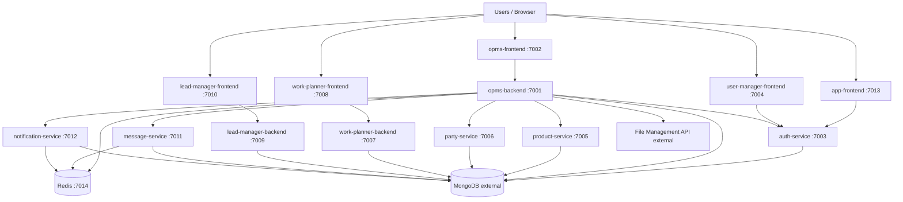

# OPMS Software Documentation

**Product:** OPMS (Order / Operations / Portal Management System) — multi-portal business platform for order lifecycle, CRM (leads), field work planning, identity/user management, and communications.

**Repository:** Monorepo at repository root (`opms 2`) containing 8 Node.js backend services, 5 Next.js frontends, Docker Compose, and host nginx TLS configs.

**Documentation status:** Generated from the current codebase. Where the repository does not define something, documents mark it as **Not identified**, **Unknown**, or **Requires confirmation**.

**Important:** Do not treat `opms-backend/docs/essentials/*` as the live workflow source of truth. Live order transitions are in `opms-backend/src/modules/workflow/workflow.transitions.js`.

---

## 1. Product

| Document | Description |
|----------|-------------|
| [Product Overview](01-product/01-product-overview.md) | Purpose, users, capabilities, boundaries |
| [PRD](01-product/02-prd.md) | Vision, user stories, FR/NFR, acceptance criteria |
| [Scope](01-product/03-scope.md) | In-scope / out-of-scope |
| [Personas and Roles](01-product/04-personas-and-roles.md) | Portals and access roles |
| [Features](01-product/05-features.md) | Feature catalog by portal |
| [Business Requirements](01-product/06-business-requirements.md) | Business requirements traced to code |
| [Non-Functional Requirements](01-product/07-non-functional-requirements.md) | Security, ops, maintainability |
| [Business Rules](01-product/08-business-rules.md) | Workflow, RBAC, blocking rules |
| [Integrations](01-product/09-integrations.md) | External systems |
| [Product Glossary](01-product/10-product-glossary.md) | Domain terms |

## 2. Architecture

| Document | Description |
|----------|-------------|
| [System Architecture](02-architecture/01-system-architecture.md) | Context and high-level topology |
| [Component Architecture](02-architecture/02-component-architecture.md) | Services and responsibilities |
| [Frontend Architecture](02-architecture/03-frontend-architecture.md) | Micro-frontends and SSO hub |
| [Backend Architecture](02-architecture/04-backend-architecture.md) | Express services, BFF pattern |
| [Service Architecture](02-architecture/05-service-architecture.md) | Service-to-service map |
| [Data Flow](02-architecture/06-data-flow.md) | Key data flows |
| [Authentication & Authorization](02-architecture/07-authentication-authorization.md) | JWT, portals, roles |
| [Integration Architecture](02-architecture/08-integration-architecture.md) | Email, WhatsApp, files, sheets |
| [Infrastructure Architecture](02-architecture/09-infrastructure-architecture.md) | Docker, Redis, Mongo, nginx |
| [Deployment Architecture](02-architecture/10-deployment-architecture.md) | Deploy topology |
| [Architecture Decisions](02-architecture/11-architecture-decisions.md) | ADR index |
| [ADRs](02-architecture/12-adr/) | Individual decision records |

## 3. Functional

| Document | Description |
|----------|-------------|
| [Authentication](03-functional/authentication.md) | Login, SSO, session |
| [Users & Identity](03-functional/users-and-identity.md) | Users, departments, portals |
| [Orders & Workflow](03-functional/orders-and-workflow.md) | Order lifecycle |
| [Approvals & Finance](03-functional/approvals-and-finance.md) | Approvals, due sheets, unbilled |
| [Dispatch & Transport](03-functional/dispatch-and-transport.md) | Dispatch, fleet, transport planner |
| [Parties & Products](03-functional/parties-and-products.md) | Masters and rates |
| [Leads & Quotations](03-functional/leads-and-quotations.md) | Lead Manager CRM |
| [Work Planner](03-functional/work-planner.md) | Plans, visits, expenses |
| [Notifications & Messages](03-functional/notifications-and-messages.md) | Push, email, WhatsApp |
| [Attachments & Files](03-functional/attachments-and-files.md) | Uploads and file API |
| [Dashboards & Activity](03-functional/dashboards-and-activity.md) | KPI dashboards |

## 4. API

| Document | Description |
|----------|-------------|
| [API Overview](04-api/01-api-overview.md) | Gateways, ports, base paths |
| [Authentication](04-api/02-authentication.md) | JWT and portal gates |
| [API Conventions](04-api/03-api-conventions.md) | Patterns, soft-delete |
| [Error Handling](04-api/04-error-handling.md) | Status codes and errors |
| [Endpoints](04-api/05-endpoints.md) | Full endpoint inventory |
| [OpenAPI](04-api/openapi.yaml) | Generated OpenAPI 3.0 inventory |

Live Swagger UI (opms-backend only): `GET /api-docs`  
Source: `opms-backend/src/docs/swagger.js`, `swaggerExtended.js`

## 5. Database

| Document | Description |
|----------|-------------|
| [Database Overview](05-database/01-database-overview.md) | MongoDB usage |
| [Schema](05-database/02-schema.md) | Schema ownership |
| [Collections](05-database/03-collections-or-tables.md) | Collection catalog |
| [Relationships](05-database/04-relationships.md) | Logical relationships |
| [Indexes](05-database/05-indexes.md) | Important indexes |
| [Constraints](05-database/06-constraints.md) | Uniqueness, enums |
| [Data Lifecycle](05-database/07-data-lifecycle.md) | Soft-delete, append-only |
| [Data Dictionary](05-database/08-data-dictionary.md) | Field dictionary |
| [ERD](05-database/09-erd.md) | Mermaid ER diagrams |

## 6. Developer & Deployment

| Document | Description |
|----------|-------------|
| [Development Overview](06-developer-deployment/01-development-overview.md) | How to work in the monorepo |
| [Prerequisites](06-developer-deployment/02-prerequisites.md) | Tools required |
| [Local Development](06-developer-deployment/03-local-development.md) | Setup steps |
| [Project Structure](06-developer-deployment/04-project-structure.md) | Directory map |
| [Environment Variables](06-developer-deployment/05-environment-variables.md) | Env catalog (no secrets) |
| [Configuration](06-developer-deployment/06-configuration.md) | Config patterns |
| [Running the Application](06-developer-deployment/07-running-the-application.md) | Commands |
| [Testing](06-developer-deployment/08-testing.md) | Test coverage status |
| [Code Quality](06-developer-deployment/09-code-quality.md) | Lint / build |
| [Git Workflow](06-developer-deployment/10-git-workflow.md) | Repo conventions |
| [Docker](06-developer-deployment/11-docker.md) | Compose services |
| [Deployment](06-developer-deployment/12-deployment.md) | Production deploy |
| [Production Runbook](06-developer-deployment/13-production-runbook.md) | Day-2 ops |
| [Monitoring](06-developer-deployment/14-monitoring.md) | Health checks |
| [Logging](06-developer-deployment/15-logging.md) | Logging approach |
| [Backup and Restore](06-developer-deployment/16-backup-and-restore.md) | Backup status |
| [Disaster Recovery](06-developer-deployment/17-disaster-recovery.md) | DR status |
| [Troubleshooting](06-developer-deployment/18-troubleshooting.md) | Common issues |
| [Security](06-developer-deployment/19-security.md) | Security notes |
| [Performance](06-developer-deployment/20-performance.md) | Performance notes |

Also see root: [DOCKER.md](../DOCKER.md)

## 7. User

| Document | Description |
|----------|-------------|
| [User Guide](07-user/01-user-guide.md) | End-user overview |
| [Getting Started](07-user/02-getting-started.md) | First login |
| [Login](07-user/03-login.md) | Login and SSO |
| [Navigation](07-user/04-navigation.md) | Apps and menus |
| [Feature Guides](07-user/05-feature-guides.md) | Feature how-tos |
| [Role Guides](07-user/06-role-guides.md) | Role-specific guides |
| [Common Tasks](07-user/07-common-tasks.md) | Task checklists |
| [Troubleshooting](07-user/08-troubleshooting.md) | User-facing issues |
| [FAQ](07-user/09-faq.md) | FAQ |

---

## Audit

- [Documentation Audit](DOCUMENTATION-AUDIT.md) — coverage, unknowns, gaps, risks

## PDF copies

Printable PDFs (Mermaid diagrams rendered) are in [`pdf/`](pdf/README.md):

| PDF | Contents |
|-----|----------|
| [OPMS-Documentation-Complete.pdf](pdf/OPMS-Documentation-Complete.pdf) | Full suite |
| [01-product.pdf](pdf/01-product.pdf) | Product |
| [02-architecture.pdf](pdf/02-architecture.pdf) | Architecture + ADRs |
| [03-functional.pdf](pdf/03-functional.pdf) | Functional |
| [04-api.pdf](pdf/04-api.pdf) | API |
| [05-database.pdf](pdf/05-database.pdf) | Database |
| [06-developer-deployment.pdf](pdf/06-developer-deployment.pdf) | Developer & deployment |
| [07-user.pdf](pdf/07-user.pdf) | User |
| [08-security.pdf](pdf/08-security.pdf) | Security (auth, RBAC, secrets, risks) |

Markdown: [`08-security/`](08-security/) — [overview](08-security/01-security-overview.md) · [threat model](08-security/02-threat-model.md) · [data protection](08-security/03-data-protection-and-ops.md) · [authorization](08-security/04-authorization-model.md)

Regenerate all: `cd docs/_pdf-build && node generate-pdf.mjs`  
Regenerate security only: `cd docs/_pdf-build && node generate-security-pdf.mjs`

---

## Quick architecture (verified)

---

## Document conventions

| Label | Meaning |
|-------|---------|
| **Verified** | Confirmed in source/config |
| **Inferred** | Strongly implied by implementation |
| **Unknown** / **Not identified** | Cannot be determined from the repository |
| **Requires confirmation** | Needs product/business clarification |

Screenshots: **Not available in repository** unless a path is cited.
